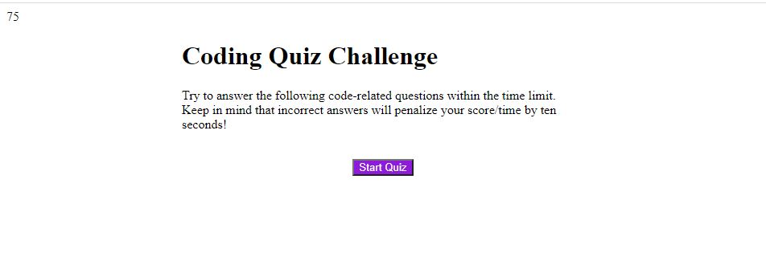

# 04 Web APIs: Code Quiz

## About

This quiz will test your knowledge of JavaScript concepts we have covered in the Coding Bootcamp. The final sccore will result from how quickly and efficiently you answered the questions.

## Contents

* Start button

    * Selecting the 'start button' prompts the quiz to begin and begins the 75 second timer/score.

* Multiple Choice buttons

    * Selecting the correct button option to the question will display 'Correct!' and take the user to the next page without deducting from the score/timer on the top left corner of the page.

    * Selecting an incorrect button option to the question will display 'Wrong Answer' and take the user to the next page and will also deduct 10 from the score/timer on the top left corner of the page.

* Timer

    * The top left side of the screen contains a score which will continue to count down from 75 seconds until all of the questions are answered. Additionally it will deduct 10 seconds for every incorrect answer selected.

* Highscore

    The user will receive a prompt to enter their initials to be saved with their score being submitted.

    

## Acceptance Criteria

```
GIVEN I am taking a code quiz
WHEN I click the start button
THEN a timer starts and I am presented with a question
WHEN I answer a question
THEN I am presented with another question
WHEN I answer a question incorrectly
THEN time is subtracted from the clock
WHEN all questions are answered or the timer reaches 0
THEN the game is over
WHEN the game is over
THEN I can save my initials and score
```

### Review

You are required to submit the following for review:

* The URL of the functional, deployed application.

* The URL of the GitHub repository. Give the repository a unique name and include a README describing the project.

- - -
© 2019 Trilogy Education Services, a 2U, Inc. brand. All Rights Reserved.
